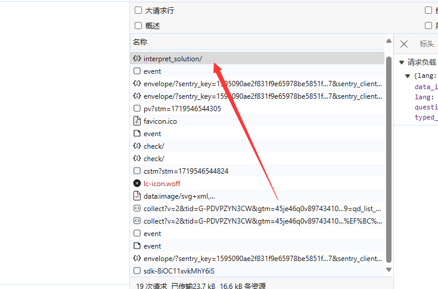
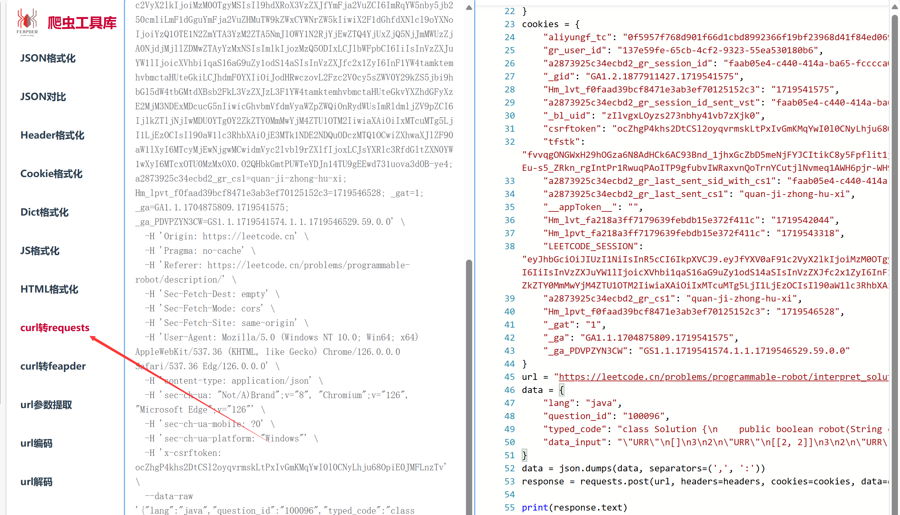

[//]: # (这个是运行)
[demo_interpret_solution.py](demo_interpret_solution.py)

[//]: # (这个是提交)
[demo_submit.py](demo_submit.py)

[//]: # (settings复制自己的cookies)

右键复制，复制为cUrl（bash）
去下面的网站转换格式，将cookie复制进settings
https://spidertools.cn/#/curl2Request
